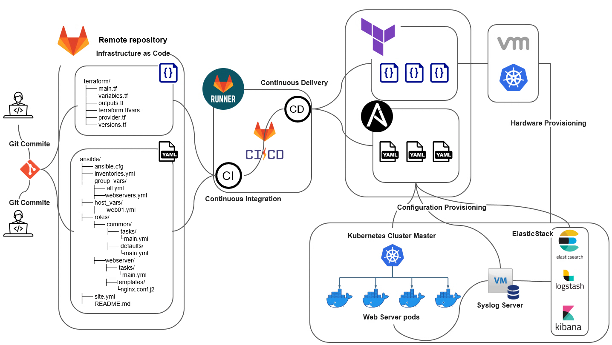

# Infrastructure Automation Project | インフラ自動化プロジェクト

> 現在このプロジェクトは主に**日本語で進行中**ですが、**英語版も準備中**です。

> This project is **currently documented primarily in Japanese**, and with English translation in progress.

---

## プロジェクト概要 | Project Overview

このリポジトリは、GitLab CI/CD・Terraform・Ansible・Kubernetes・ELK Stack を活用したインフラ自動化、IaCの構成を示しています。

This repository documents an infrastructure automation system using GitLab CI/CD, Terraform, Ansible, Kubernetes, and ELK Stack.

---

## 構成図 | Architecture Diagram

---

## リポジトリ構成 | Repository Structure

| Repository Name | Description |
|------------------|-------------------|
| [Ansible_Main](https://github.com/Emryslee/Ansible_Main) | Ansible実行環境・変数管理 / Asible environment & Variables |
| [Ansible_Roles](https://github.com/Emryslee/Ansible_Roles) | 各種Ansibleロール群 / Ansible roles |

---

## 技術Stack | Technology Stack

- **CI/CD**：GitLab + GitLab Runner  
- **Infrastructure as Code**：Terraform  
- **構成管理 / Configuration Management**：Ansible  
- **コンテナオーケストレーション**：Kubernetes  
- **ログ収集と可視化 / Log Aggregation & Visualization**：Syslog + Elastic Stack

---

## 自動化の流れ | Automation Flow

1. **Git Push により GitLab CI/CD トリガーが起動**
2. **Terraform によるインフラ構築（VM / Kubernetes クラスタ）**
3. **Ansible による構成プロビジョニング（初期設定, Syslog Server, Web Server, Docker等）**
4. **Kubernetes で Web Pod 配備**
5. **ログを Syslog 経由で ELK Stack に連携し、可視化**

---

##　現在の進捗 | Current Status

- GitLab CI/CD 構築完了 / GitLab CI/CD configured  
- Ansible 実行環境・commonロール作成中 / Currently developing the Ansible execution environment and the common role  
- Terraform/Kubernetes/ログ連携部分は今後対応予定 / Terraform, Kubernetes, and log integration are being planned  
- 本プロジェクトは現在進行中であり、継続的にアップデートされます  
  This project is currently under active development and will be updated continuously.

各リポジトリの詳細は、それぞれの `README.md` にてご確認ください。  
Please refer to the README of each repository for further details.